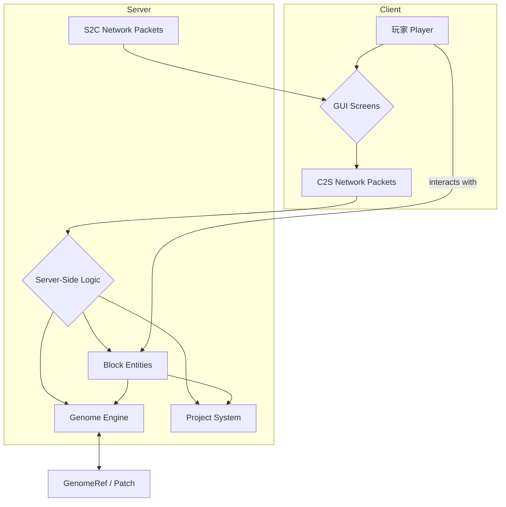

# GenomeWorkbench 设计文档 (DESIGN.md)

## 1. 系统架构

本模组遵循标准的 Fabric Mod 架构，同时采用客户端-服务器（C/S）分离的设计原则，确保所有关键游戏逻辑和数据都由服务器权威处理。

### 1.1. 核心原则

*   **服务器权威 (Server-Authoritative)**: 所有的基因组数据、玩家进度、科研项目和实验结果都存储在服务器端。客户端仅作为视图渲染和用户输入的接口。
*   **按需数据 (Data-on-Demand)**: 基因组序列等大数据绝不一次性完整加载到内存或在网络上传输。客户端需要时，通过分页请求向服务器获取数据片段。
*   **模块化 (Modularization)**: 代码按功能分为清晰的包（registry, data, genome, machines, screens, network, projects, ethics, util），便于维护、扩展和测试。

### 1.2. 主要模块交互



## 2. 数据模型

### 2.1. 参考基因组 (`GenomeRef`)

这是一个不可变对象，代表一个虚拟的参考基因组。它不存储实际的序列，而是通过算法确定性地生成。

*   `genomeId (UUID)`: 唯一标识一个基因组。
*   `seed (long)`: 随机数种子，用于确定性地生成序列。
*   `length (long)`: 基因组的总长度。
*   `chromosomes (Map<String, Long>)`: 染色体名称到其长度的映射。

关键方法:
*   `byte baseAt(long position)`: 返回指定位置的碱基 (A, C, G, T)，以 2-bit 编码形式 (00, 01, 10, 11)。

### 2.2. 基因组补丁 (`GenomePatch`)

表示对 `GenomeRef` 的一组修改。只存储差异，非常轻量。

*   `patchId (UUID)`: 补丁的唯一 ID。
*   `refGenomeId (UUID)`: 该补丁对应的参考基因组 ID。
*   `mutations (Map<Long, Byte>)`: 存储点突变，key 为位置，value 为新的碱基 (2-bit)。
*   `indels (List<IndelRecord>)`: 存储插入和删除。`IndelRecord` 包含位置、类型（插入/删除）和序列。

### 2.3. 样本 (`Sample`)

代表玩家在游戏中获得的生物样本。

*   `sampleId (UUID)`
*   `source (String)`: 样本来源 (e.g., "Creeper", "Pig")。
*   `genomeId (UUID)`: 关联的 `GenomeRef` ID。
*   `patches (List<UUID>)`: 应用于此样本的 `GenomePatch` ID 列表。
*   `purity (float)`: 纯度，影响实验成功率。
*   `contamination (List<String>)`: 污染源列表。

### 2.4. 实验报告 (`QCReport`)

所有实验设备（PCR, 测序仪等）的输出都是一份或多份报告。报告是不可变的，并作为“证据链”的一部分。

*   `reportId (UUID)`
*   `type (String)`: e.g., "PCR", "SEQUENCING", "GEL_ELECTROPHORESIS".
*   `inputSample (UUID)`
*   `outcome (NbtCompound)`: 存储该类型报告的具体结果。例如，测序报告会包含 ReadSet 摘要，电泳报告会包含条带信息。
*   `status (String)`: "SUCCESS", "FAILED", "CONTAMINATED".
*   `notes (String)`: 对结果的文字解释。

## 3. 网络协议

所有自定义网络数据包都通过 Fabric Networking API 发送。

### 3.1. C2S (Client-to-Server)

*   `RequestGenomeSlicePacket`: 客户端请求基因组窗口数据。
    *   `genomeId (UUID)`
    *   `start (long)`
    *   `length (int)`
    *   `patchIds (List<UUID>)`
*   `MachineInteractionPacket`: 客户端在机器 GUI 上的操作。
    *   `blockPos (BlockPos)`
    *   `action (Identifier)`
    *   `payload (NbtCompound)`

### 3.2. S2C (Server-to-Client)

*   `SendGenomeSlicePacket`: 服务器发回基因组窗口数据。
    *   `genomeId (UUID)`
    *   `start (long)`
    *   `packedBases (byte[])`: 2-bit 编码的碱基序列。
    *   `annotations (NbtList)`: 该区域内的标注信息（如突变位点、motif 匹配）。
*   `UpdateMachineScreenPacket`: 更新机器 GUI 的状态。
    *   `blockPos (BlockPos)`
    *   `screenData (NbtCompound)`

### 3.3. 性能与安全

*   **速率限制**: 服务器会对 `RequestGenomeSlicePacket` 进行简单的速率限制，防止客户端滥用请求。
*   **长度限制**: 单次请求的 `length` 不得超过一个最大值（e.g., 4096 bp）。
*   **缓存**: 客户端可以实现一个 LRU 缓存来存储最近查看过的基因组切片，减少不必要的网络请求。

## 4. “不存储全量序列”的技术方案

### 4.1. 确定性生成

`GenomeRef.baseAt(pos)` 的实现依赖于一个伪随机数生成器。通过使用 `(seed + pos)` 作为种子，我们可以为每个位置确定性地生成一个碱基，而无需存储整个序列。

```java
// 伪代码
public byte baseAt(long position) {
    Random random = new Random(this.seed + position);
    return (byte) random.nextInt(4);
}
```

### 4.2. 2-bit 编码

为了节省空间，碱基不以字符形式存储。而是使用 2 个比特位：
*   A -> `00`
*   C -> `01`
*   G -> `10`
*   T -> `11`

一个字节（8-bit）可以存储 4 个碱基。一个 4096 bp 的切片只需要 1024 字节。

### 4.3. Patch 叠加

当客户端请求一个带有补丁的基因组切片时，服务器执行以下步骤：
1.  生成基础的 `GenomeRef` 切片。
2.  解码 2-bit 序列。
3.  遍历 `GenomePatch` 列表，将每个补丁中的突变和 indel 应用到切片上。
4.  重新编码为 2-bit 序列，发送给客户端。

## 5. 扩展点

### 5.1. `GenomeProvider` 接口

为了未来的云端集成，基因组的获取将被抽象为一个接口。

```java
public interface GenomeProvider {
    // 异步获取一个基因组切片
    CompletableFuture<byte[]> fetchSlice(UUID genomeId, long start, int length);
}
```

*   `LocalProceduralProvider`: 默认实现，使用 `GenomeRef` 的确定性生成算法。
*   `CloudSliceProvider` (TODO): 未来的实现，通过 HTTP 请求从外部 API 获取真实的基因组数据切片。这将允许模组与 ENSEMBL, UCSC 等真实数据库（的代理 API）进行交互。

### 5.2. `AnalysisModule` 接口

Genome Terminal 的分析功能（如 motif 搜索）可以通过模块化接口进行扩展，允许添加新的分析算法。

## 6. 版本兼容性与升级

*   **版本号**: 遵循 `Major.Minor.Patch` 语义化版本。Alpha/Beta 阶段版本号为 `0.x.x`。
*   **数据迁移**: 在 `0.x.x` 阶段，不保证存档兼容性。每次重大数据模型变更都可能需要玩家创建新世界。在 `1.0.0` 之后，将提供数据修复器（DataFixer）来保证向后兼容性。

---
*这份文档是动态的，会随着开发的进展而更新。*
